# Welcome to BYOD Hack Challenge!

The concept of **Bring Your Own Device (BYOD)** originates from the IT and enterprise world, where employees were encouraged to connect their personal laptops and smartphones to corporate networks. Over time, BYOD has evolved into a broader paradigm, highlighting the value of **personalized, user-driven technology ecosystems**.  

In the context of **Software-Defined Vehicles (SDVs)**, BYOD takes on a new dimension. Instead of limiting drivers and passengers to pre-installed, manufacturer-defined features, vehicles can become **open platforms** where users bring their own devices, e.g., portable coffee machine, gaming gear, VR headsets, karaoke microphones, etc., into the mobility experience.  

This shift has the potential to **unlock personalization, flexibility, and entirely new in-car experiences**. To demonstrate this vision in practice, the **BYOD Hack Challenge** rallies developers, designers, and hardware tinkerers to prove the power of [digital.auto](https://digital.auto) by wiring their own devices into three showcase apps:

- **Personalized Passenger Welcome**   
The vehicle recognizes the passenger and adapts the environment automatically —> adjusting seats, lights, turning on Coffee Machine and Air Despenser. This transforms a simple ride into a tailored, welcoming experience for everyone who enters.

- **Bring-your-Own Karaoke**  
Will be updated very soon!

- **In-Vehicle Gaming**   
Passengers can connect gaming devices such as a piano board, where every note played is reflected in the car's Infotainment System, turning the car into a musical playground. Another game leverages live ADAS data to create an interactive driving simulation game, blending real vehicle signals with fun, gamified experiences

## 1. Challenge Overview

During the hackathon, teams will use the **digital.auto Playground** as their primary environment to **program, prototype, and demo** their BYOD applications. The Playground shares the same **SDV Runtime** with the vintage test vehicle, ensuring that every idea built virtually is immediately reflected in the real car.  

Through the standardized **Vehicle Signal Specification (VSS) APIs**, teams can connect their devices and control a variety of in-car actuators, such as ambient lights, windows, coffee machines, and air dispensers, turning everyday gadgets into fully integrated automotive features. Some examples of these actuators are as follows:

- **Ambient Lights** – change colors, brightness, or make some cool light patterns.
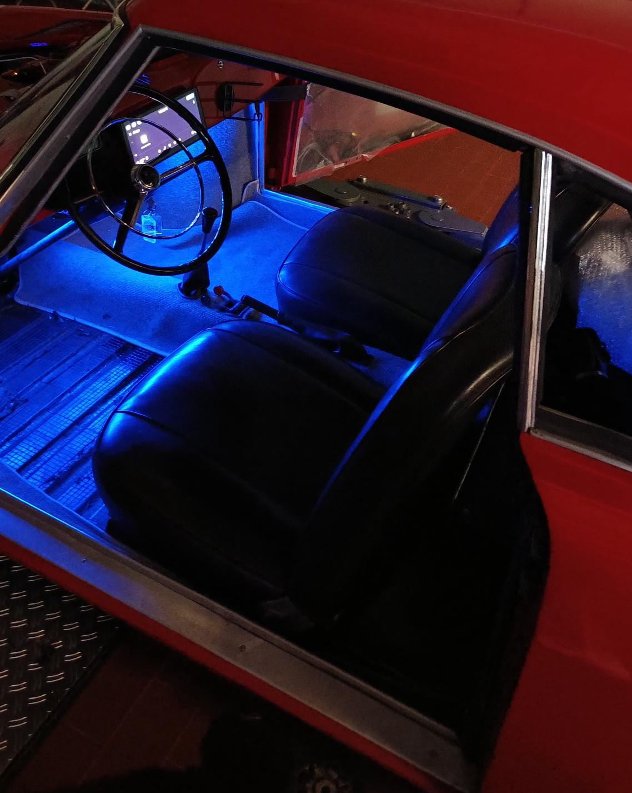

-  **Coffee Machine** – trigger brewing cycles or create fun “car café” experiences.
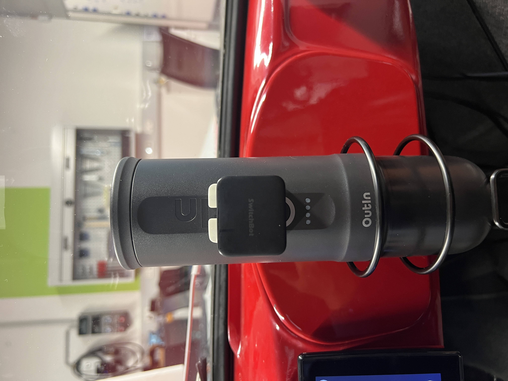

- **Air Dispenser** –  scents, synchronize with mood or events.
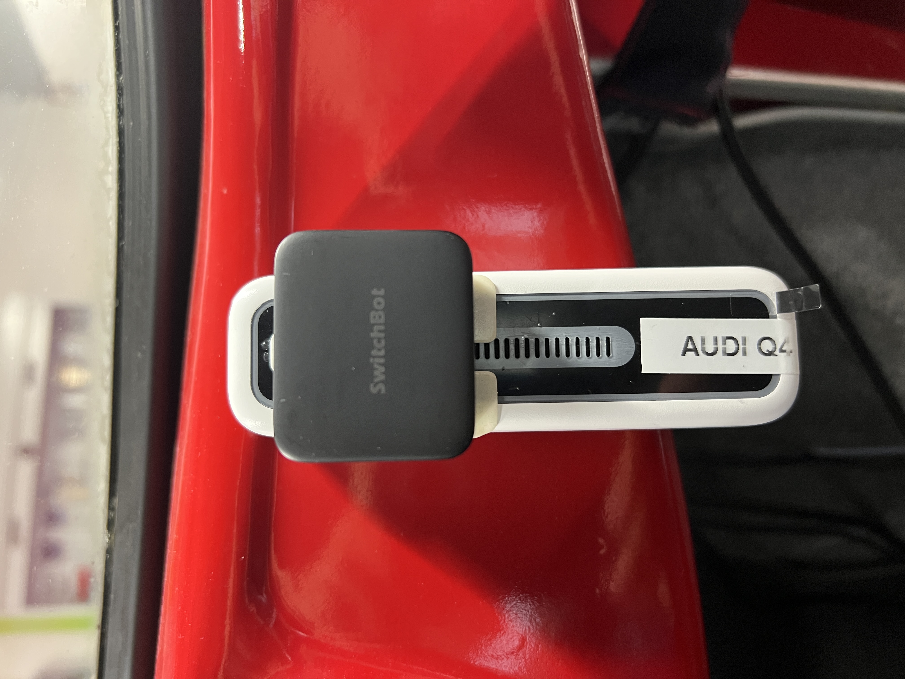

-  **Smart windows** – adjust tint, transparency, or create dynamic visual effects. 

In addition, participants will have access to dummy ADAS data (e.g., speed, lane position, nearby objects), enabling them to build their own advanced applications — from gamified driving simulations to innovative safety and personalization features.
  
All taking place inside **a vintage car, reborn as an SDV test vehicle**.

### 1.1 digital.auto Playground

The hackathon runs on the [digital.auto Playground](https://playground.digital.auto/) – the central program environment for participants. 
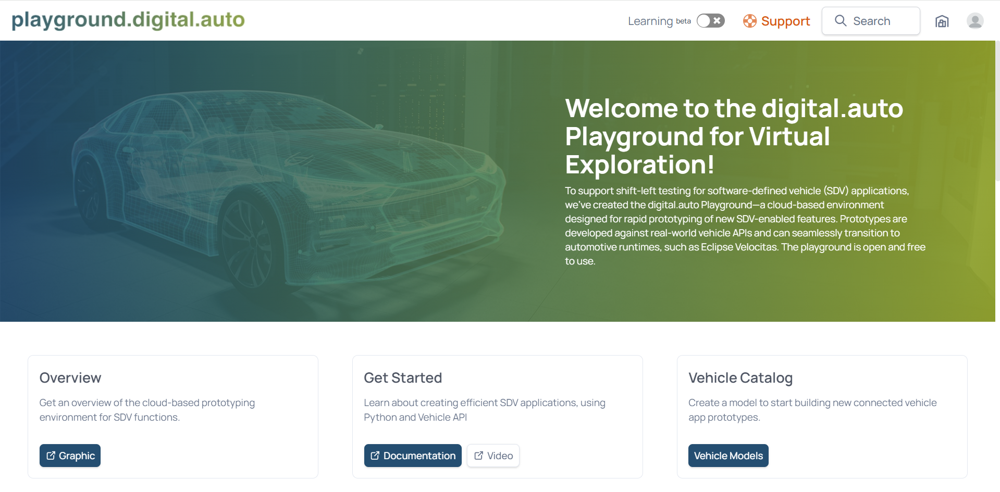

The digital.auto Playground is the heart of the BYOD Hack Challenge. 
It acts as both a simulator and a live bridge to the physical vehicle, letting participants experiment freely with ideas before deploying them in the real world. 
This combination of safe virtual prototyping and real-world mirroring makes the Playground the ultimate testbed for innovation.

Here are a few pointers to keep in mind about the playground: 
- Playground shares the **same SDV Runtime** as the vintage test vehicle.  
- Any **VSS (Vehicle Signal Specification)**–based animation or value change in Playground is immediately reflected in the car.  
- This allows developers to **prototype and validate ideas in real time**, ensuring that what they build in Playground directly maps onto the physical vehicle.  

**A typical development workflow in the playground with SDV-Runtime includes the following steps**:

- From the list of available models, Select the 'EDCAR' model. You can also access the model through this link: https://playground.digital.auto/model/68a585adc63a4c48cca0be49
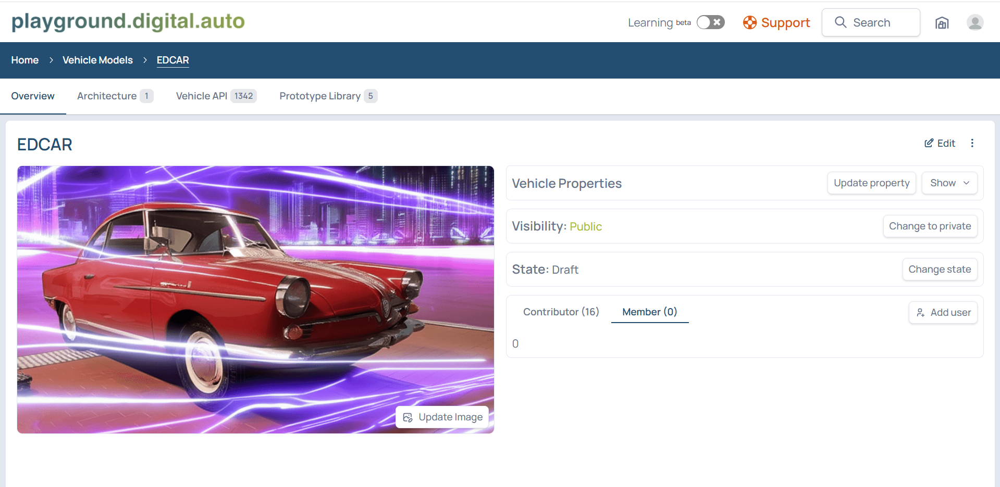

- Explore available vehicle signals in the Vehicle API subtab.
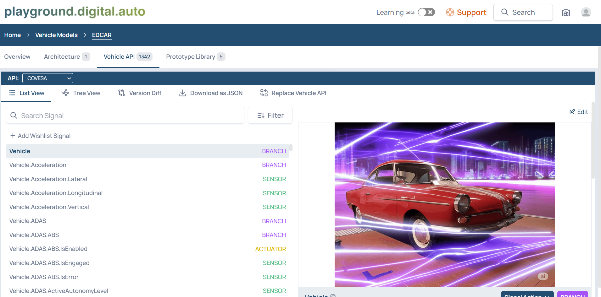

- Create a new prototype within the EDCAR Model and name the prototype - 'IAA2025_TeamName_UseCaseName'. 
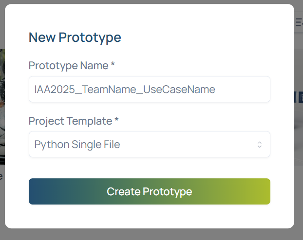

- Open the SDV Code or Dashboard subtab and select runtime named "**Runtime-IAA_Hackathon**" (This will be avaliable at the time of Hackathon).
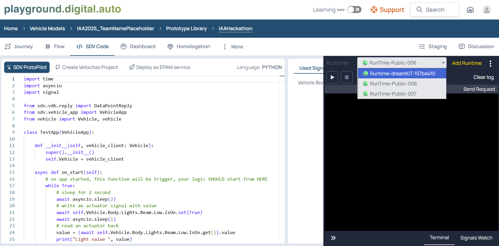

- Develop your application using the Python editor.
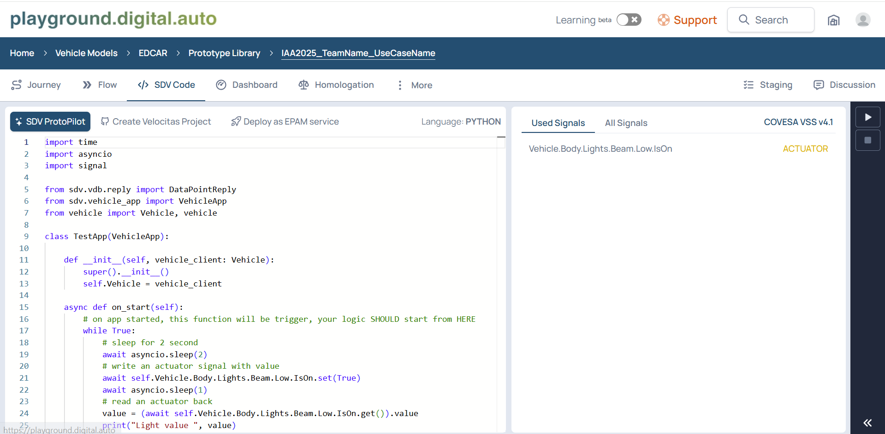

- Test your application within the playground environment and on the Dashboard.
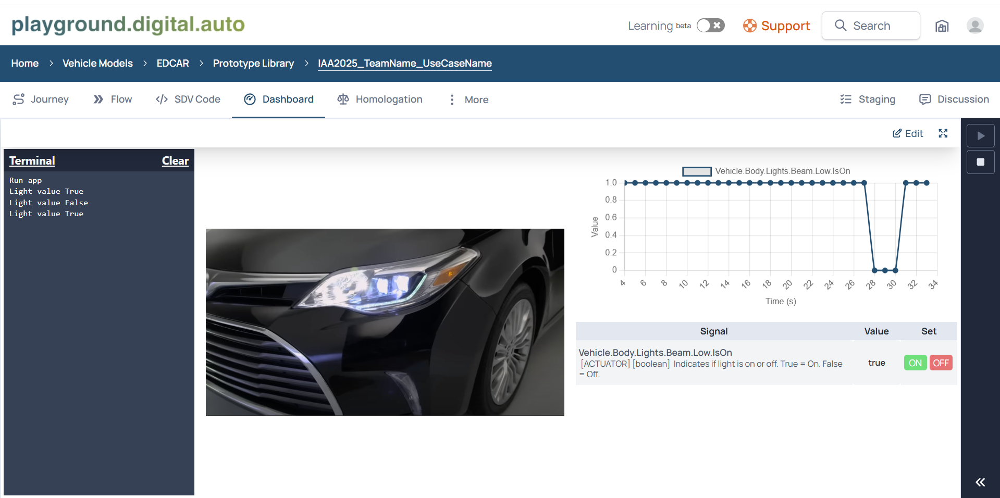

To build your first application on the playground, you can refer to this site : https://docs.digital.auto/docs/epic/runtime/getting-started/first-application/index.html

👉 Think of Playground as your **safe lab + remote control**, while the vintage car acts as the **real-world mirror** of your experiments.

### 1.2 EDCAR (NSU Prinz)

Our vintage NSU Prinz, reborn as EDCAR, is the centerpiece of the hackathon. It is powered by the dreamKIT platform from digital.auto (https://www.digital.auto/dreamkit)
, which seamlessly connects the physical car to the digital.auto Playground so that every prototype built virtually can be mirrored in the real vehicle.

Inside EDCAR, multiple processors work together to bring modern SDV capabilities into the classic car:

- High-performance SoCs (e.g., Qualcomm 8295) running Android OS to power infotainment and app experiences.
- Microcontrollers and edge boards (e.g., Raspberry Pi, Arduino-class MCUs) to handle real-time controls such as lights, actuators, and connected devices.
- dreamKIT middleware providing standardized APIs for VSS-based communication between apps, devices, and vehicle systems.

This hybrid setup allows participants to experiment safely with both cloud-native SDV software and hardware-level integrations, demonstrating how consumer devices can become part of a modern mobility ecosystem.  
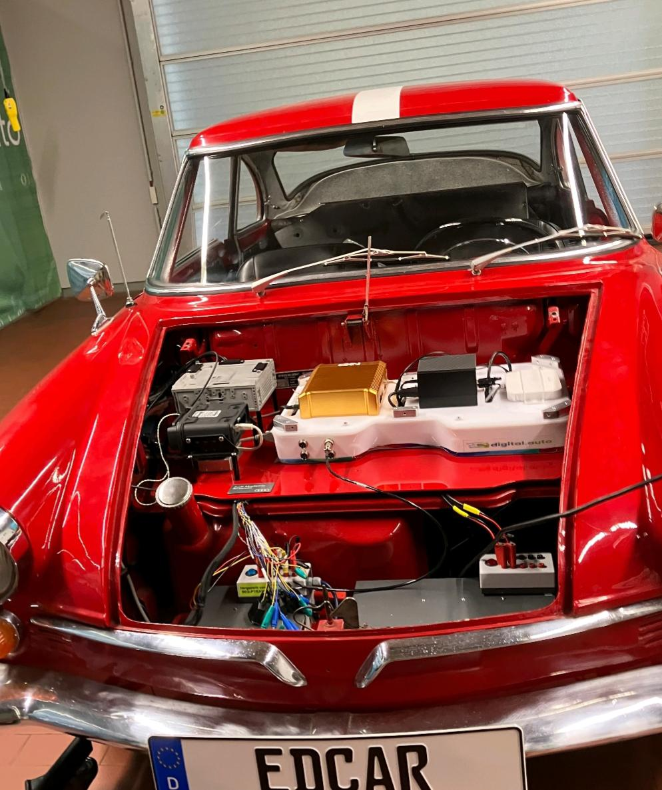

## 2. Resources

Participants have access to the following tools and references to prototype quickly:

- digital.auto official site: https://digital.auto
- digital.auto Playground: https://playground.digital.auto
- Playground Documentation: https://docs.digital.auto/ 
- EDCAR runtime
- Vehicle Signal Specification APIs(VSS): https://covesa.global/vss 
- dreamKIT GitHub Repository: https://github.com/eclipse-autowrx/dreamKIT 

Example VSS APIs

Below are some example VSS signals that you can use to control devices or read data during the hackathon.

**Ambient Light**

Interior Lights: 
- Vehicle.Body.AmbientLight.IsOn – turn ambient lights on/off
- Vehicle.Cabin.Light.AmbientLight.Row1.DriverSide.Color – set RGB color of lights
- Vehicle.Body.AmbientLight.Intensity – adjust brightness

Exterior Lights: 
- Vehicle.Body.Lights.Beam.High.IsOn
- Vehicle.Body.Lights.Beam.Low.IsOn
- Vehicle.Body.Lights.Brake.IsActive
- Vehicle.Body.Lights.DirectionIndicator.Left.IsSignaling
- Vehicle.Body.Lights.DirectionIndicator.Right.IsSignaling
- Vehicle.Body.Lights.Hazard.IsSignaling
- Vehicle.Body.Lights.Fog.Rear.IsOn
- Vehicle.Body.Lights.Underglow.Left.Animation
- Vehicle.Body.Lights.Underglow.Left.Color
- Vehicle.Body.Lights.Underglow.Left.Intensity
- Vehicle.Body.Lights.Underglow.Left.IsOn
- Vehicle.Body.Lights.Underglow.Right.Animation
- Vehicle.Body.Lights.Underglow.Right.Color
- Vehicle.Body.Lights.Underglow.Right.Intensity
- Vehicle.Body.Lights.Underglow.Right.IsOn

**Coffee Machine**

- Vehicle.BYOD.CoffeeMachine.Brew – start/stop brewing

**Air Dispenser**

- Vehicle.BYOD.Airfreshner.IsOn – switch air dispenser on/off

**ADAS Data (Dummy Feed)**

- Vehicle.Speed – current vehicle speed

to quickly prototype and integrate their ideas.

## 3. Live Demo

Teams will demo their solutions **live** to a jury of OEM and tech-platform experts.  

The goal:  
Show that standardized **BYOD interfaces** can turn almost any consumer gadget into a **safe, revenue-ready automotive feature**—and spark the next wave of in-car delight.

---

🚗 **Hack. Prototype. Drive. Let’s bring BYOD to life in SDVs!**
