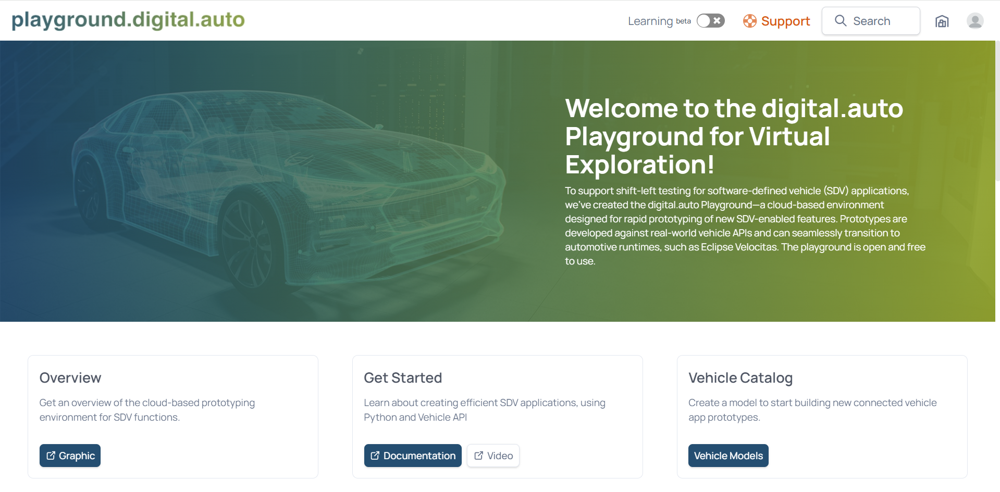
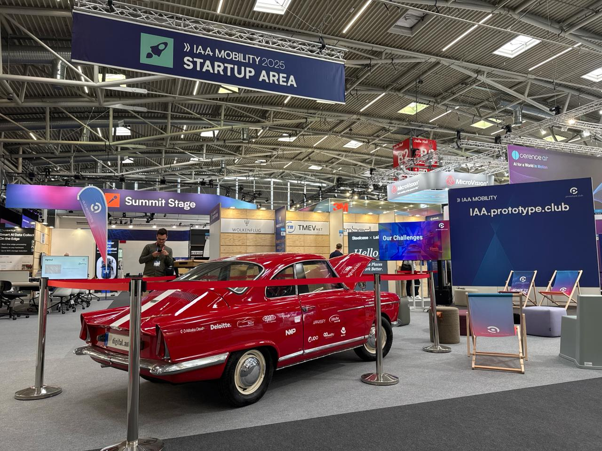

# Welcome to V2R (Virtual-2-Real) Hack Challenge!

# Airbag - Hit and Run Use Case

Modern vehicles are rapidly evolving into **Software-Defined Vehicles (SDVs)**, where safety features are no longer limited to passive mechanisms but can be extended with intelligent, connected software.

The V2R Hack Challenge focuses on exploring how **hit-and-run detection signals** can be transformed into innovative applications for safety, emergency response, and analysis.

Using the digital.auto Playground as the simulation sandbox, participants will design, prototype, and validate intelligent safety features such as automatic post-crash response, collision logging, and impact-aware alerts, first in a virtual environment, then in a vintage car refitted as an SDV test bed.

This hackathon challenges participants to imagine, design, and prototype safety-focused applications that make mobility not only smarter, but also **safer for passengers and pedestrians**.

---

## 1. Challenge Overview

During the hackathon, teams will use the [digital.auto Playground](https://playground.digital.auto/) as their primary environment to program, prototype, and demo their applications. The Playground mirrors the SDV Runtime of the vintage test vehicle, ensuring every software event from an airbag signal to actuator value is immediately reflected in the real car.

As part of this challenge, Teams can:

1) Access the following VSS signal :  **Vehicle.CrashOutput.DetectionCrashType**.

The following table consits of the Bit Encoding for VSS signal Vehicle.CrashOutput.DetectionCrashType:	

| Bit | What value 0 means | What value 1 means |
|----------|----------|----------|
| Bit 0 | 0 : No crash | 1 : Front crash is detected |
| Bit 1 | 0 : No crash | 1 : Left side crash is detected |
| Bit 2 | 0 : No crash | 1 : Right side crash is detected |
| Bit 3 | Not used, always 0 |
| Bit 4 | 0 : Major severity | 1 : Minor severity |
| Bit 5 | Not used, always 0 |
| Bit 6 | Not used, always 0 |
| Bit 7 | Not used, always 0 |

Few examples derived from the logic above: 
- If value is 0, then there is no crash detected.
- If value is 0x11 (0b0001 0001), then minor front crash is detected
- If value is 0x01 (0b0000 0001), then major front crash is detected
- If value is 0x12 (0b0001 0010), then minor left crash is detected

2) Based on the above values,whenever a crash is detected, trigger exterior or interior lights with different intensities based on the severity of crash type. 
Use the **EDCAR Model** which contains the relevant VSS signals, to create a new prototype. 
- **Example Idea** : Turn on exterior lights with a high intensity when a major crash is detected.

3) Store and share data with cloud-based services.

This enables developers to transform raw safety signals into **life-saving applications**.

---

## 1.1 digital.auto Playground

The Playground is both a **safe simulator** and a **live bridge** to the physical EDCAR (our test vehicle).

* Any VSS signal change in Playground is immediately reflected in the car.
* Developers can safely test crash scenarios on the real vehicle.
* Prototypes are built using the **Python editor** inside Playground.
* Refer to the [BYOD Instruction doc](https://github.com/prototype0club/IAAMOBILITYHACKATHON/blob/main/BYOD%20Bring%20Your%20Own%20Device/instructions.md) file, a detailed implementation guideline for building different use cases in the digital.auto Playground.

---

## 1.2 EDCAR (NSU Prinz)

Our vintage NSU Prinz, reborn as **EDCAR**, is powered by the **dreamKIT platform** from digital.auto. It connects seamlessly to the Playground and includes:

* High-performance processors for infotainment + safety apps.
* Edge controllers (e.g., Raspberry Pi, MCUs) for actuators like hazard lights and locks.
* dreamKIT middleware exposing **standardized VSS APIs** for airbags and vehicle signals.

This lets teams experiment with safety-critical apps in a **controlled environment**.

---

## 2. Resources

* digital.auto official site: [https://digital.auto](https://digital.auto)
* digital.auto Playground: [https://playground.digital.auto](https://playground.digital.auto)
* Playground Documentation: [https://docs.digital.auto/](https://docs.digital.auto/)
* Vehicle Signal Specification (VSS): [https://covesa.global/vss](https://covesa.global/vss)
* dreamKIT GitHub Repository: [https://github.com/eclipse-autowrx/dreamKIT](https://github.com/eclipse-autowrx/dreamKIT)

---

### Example VSS APIs

**Crash Type Detection**

- `Vehicle.CrashOutput.DetectionCrashType` – Crash Type provided by the Airbag ECU unit, 8 bit encoded value

**Exterior Lights**

- `Vehicle.Body.Lights.Beam.High.IsOn`
- `Vehicle.Body.Lights.Beam.Low.IsOn`
- `Vehicle.Body.Lights.Brake.IsActive`
- `Vehicle.Body.Lights.DirectionIndicator.Left.IsSignaling`
- `Vehicle.Body.Lights.DirectionIndicator.Right.IsSignaling`
- `Vehicle.Body.Lights.Hazard.IsSignaling`
- `Vehicle.Body.Lights.Fog.Rear.IsOn`
- `Vehicle.Body.Lights.Underglow.Left.Animation`
- `Vehicle.Body.Lights.Underglow.Left.Color`
- `Vehicle.Body.Lights.Underglow.Left.Intensity`
- `Vehicle.Body.Lights.Underglow.Left.IsOn`
- `Vehicle.Body.Lights.Underglow.Right.Animation`
- `Vehicle.Body.Lights.Underglow.Right.Color`
- `Vehicle.Body.Lights.Underglow.Right.Intensity`
- `Vehicle.Body.Lights.Underglow.Right.IsOn`

**Interior Lights**

- `Vehicle.Body.AmbientLight.IsOn` – turn ambient lights on/off
- `Vehicle.Cabin.Light.AmbientLight.Row1.DriverSide.Color` – set RGB color of lights
- `Vehicle.Body.AmbientLight.Intensity` – adjust brightness
---

## 3. Live Demo

Teams will demo their prototypes live to a jury of OEM and safety experts.

The goal:
Show how **standardized SDV interfaces** can transform raw airbag and collision signals into **life-saving, connected mobility applications**, potentially redefining post-crash safety standards.

---

🚗 **Hack. Prototype. Drive. Let’s bring safety innovation to life in SDVs!**
